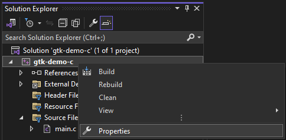
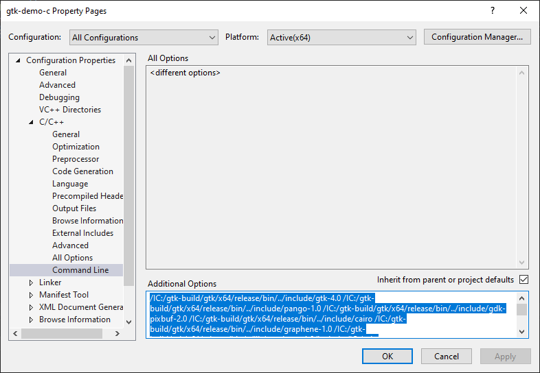

# gvsbuild


This python script helps you build a full [GTK](https://www.gtk.org/) library
stack for Windows using Visual Studio. Currently, GTK 3 and GTK 4 are supported.

## Install GTK Only

If you want to only run GTK on Windows and not build it yourself, you can download
a zip file from the last release and unzip it to `C:\gtk`.

It comes with GTK4, Cairo, PyGObject, Pycairo, GtkSourceView5, adwaita-icon-theme, and
all of their dependencies.

Note however that these binaries are provided “AS IS”, WITHOUT WARRANTY OF ANY KIND.
They just contain the output of our latest CI run. They are not tested, and we cannot
commit to timely updates even for security issues. We strongly recommend to build your
own binaries, especially if you plan to distribute them with your application or use them in
production.

### Environmental Variables
Finally, add GTK to your environmental variables with:

```PowerShell
$env:Path = "C:\gtk\bin;" + $env:Path
$env:LIB = "C:\gtk\lib;" + $env:LIB
$env:INCLUDE = "C:\gtk\include;C:\gtk\include\cairo;C:\gtk\include\glib-2.0;C:\gtk\include\gobject-introspection-1.0;C:\gtk\lib\glib-2.0\include;" + $env:INCLUDE
```

### PyGObject and PyCairo

If you are going to use PyGObject and Pycairo, you also need to use the gvsbuild
generated wheels with your [Python virtualenv](https://docs.python.org/3/tutorial/venv.html)
in order to work around this [PyGObject bug](https://gitlab.gnome.org/GNOME/pygobject/-/issues/545):

```PowerShell
pip install --force-reinstall (Resolve-Path C:\gtk\wheels\PyGObject*.whl)
pip install --force-reinstall (Resolve-Path C:\gtk\wheels\pycairo*.whl)
```

## Build GTK

The script supports multiple versions of Visual Studio - at the moment we are
focusing on VS 2022, but we include projects for other versions, and we gladly
accept patches.

The script focuses on GTK and the surrounding ecosystem (e.g. GStreamer).
However, we are open to adding more libraries as long as the contributor takes
on the responsibility for keeping it up to date. The supported projects are
modules in the
[projects](https://github.com/wingtk/gvsbuild/blob/master/gvsbuild/projects)
directory.

The script requires a working installation of [Visual Studio for Windows
Desktop](http://www.visualstudio.com), [Python 3](https://www.python.org) and
[msys2](https://msys2.github.io). The script will download any additional tools
required to build the libraries and will use them from a local directory,
without any installation. As of today these tools include cmake, meson, ninja,
nuget and perl.

The script fetches source tarballs for the projects from their original
locations, however in some cases it might be necessary to host a patched tarball
on GitHub. To ensure integrity of the downloaded files, the script checks the
SHA256 hash of each download. Downloads are done using TLS, using SSL
certificates provided by the system, but in case of error the download is tried
again ignoring certificate errors.

### Development Environment

#### Choco
We recommend using [Chocolately](https://chocolatey.org/) as a package manager
in Windows.

To install it, open PowerShell as an administrator, then execute:

```PowerShell
Set-ExecutionPolicy Bypass -Scope Process -Force; iex ((New-Object System.Net.WebClient).DownloadString('https://community.chocolatey.org/install.ps1'))
```
To run local scripts in follow-on steps, also execute
`Set-ExecutionPolicy RemoteSigned`. This allows for local PowerShell scripts
to run without signing, but still requires signing for remote scripts.

#### Git
To setup a development environment in Windows install
[Git](https://gitforwindows.org) by executing as an administrator:

```PowerShell
choco install git
```

#### MSYS2
Both of the development environments in the next steps need MSYS2 installed.

Install [MSYS2](http://www.msys2.org/):

Keep PowerShell open as administrator and execute:
```PowerShell
choco install msys2
```

#### Building GTK

First we will install the gvsbuild dependencies:
1. Visual C++ build tools workload for Visual Studio 2022 Build Tools
2. Python

#### Install Visual Studio 2022
With your admin PowerShell terminal:

```PowerShell
choco install visualstudio2022-workload-vctools
```

Note: Visual Studio versions 2013 (not for all projects), 2015, 2017, 2019, and 2022 are currently supported.

#### Install the Latest Python

In Windows, The official installer contains all the Python components and is the
best option for developers using Python for any kind of project.

For more information on how to use the official installer, please see the
[full installer instructions](https://docs.python.org/3/using/windows.html#windows-full).
The default installation options should be fine for use with gvsbuild.

1. Install the latest Python version using the
[official installer](https://www.python.org/downloads/windows/).

2. Open a PowerShell terminal as a normal user and check the python version:

   ```PowerShell
   py -3.12 --version
   ```

#### Install gvsbuild

The recommended way to install gvsbuild is with pipx. Open a new regular user
PowerShell terminal and execute:

```PowerShell
py -3.12 -m pip install --user pipx
py -3.12 -m pipx ensurepath
pipx install gvsbuild
```

Alternatively, you can also use git to clone the repository and install it.
Open a new regular user PowerShell terminal and execute:

```PowerShell
mkdir C:\gtk-build\github
cd C:\gtk-build\github
git clone https://github.com/wingtk/gvsbuild.git
cd C:\gtk-build\github\gvsbuild
python -m venv .venv
.\.venv\Scripts\activate.ps1
pip install .
```

#### Build GTK

In the same PowerShell terminal, execute:

```PowerShell
gvsbuild build gtk3
```

Alternatively, if you want to build GTK 4, execute:
```PowerShell
gvsbuild build gtk4
```

Grab a coffee, the build will take a few minutes to complete.

#### Add GTK to Your Environmental Variables

1. From the Start menu, go to the Control Panel entry for “Edit environment variables for your account”.
2. Double-click the `Path` row in the top list of variables. Click “New” to add a new item to the list.
3. Paste in `C:\gtk-build\gtk\x64\release\bin`
4. Click "OK" twice.

#### Using GTK with Visual Studio

1. Open Visual Studio and "Create a new project" using the "Empty Project" template
2. On the left, right click on "Source Files" and choose "Add", then "New Item..." and replace the name with `main.c`
3. Paste in the following contents, then save the file:

   ```
   #include <gtk/gtk.h>
   
   static void activate_cb(GtkApplication *app) {
     GtkWidget *window = gtk_application_window_new(app);
     gtk_widget_set_visible(window, true);
   }
   
   int main(int argc, char **argv) {
     GtkApplication *app =
         gtk_application_new("org.app", G_APPLICATION_DEFAULT_FLAGS);
     g_signal_connect(app, "activate", G_CALLBACK(activate_cb), NULL);
     return g_application_run(G_APPLICATION(app), argc, argv);
   }
   ```

4. Go to your project's settings by right-clicking and choosing "Properties"

   

5. On the left, open "C/C++", then choose "Command Line".
   1. Open "Powershell" and run the command `pkg-config --cflags gtk4 --msvc-syntax`
   2. Paste the result into the "Additional Options" field at the bottom of the Visual Studio Properties window.

   

6. Still in the Visual Studio window, click on "Linker" and choose "Command Line". Do the same thing as the last step, except use the output of `pkg-config --libs gtk4 --msvc-syntax`
7. Click "OK"
8. In the top menu bar, click "Debug" and "Start Without Debugging"

#### Using GTK with Rust

See [the fantastic `gtk-rs` book](https://gtk-rs.org/gtk4-rs/stable/latest/book).
You can skip the "Install GTK 4" step, as the above steps ^ covered that.

#### Use PyGObject

First, add GTK to your environment variables:

```PowerShell
$env:LIB = "C:\gtk-build\gtk\x64\release\lib;" + $env:LIB
$env:INCLUDE = "C:\gtk-build\gtk\x64\release\include;C:\gtk-build\gtk\x64\release\include\cairo;C:\gtk-build\gtk\x64\release\include\glib-2.0;C:\gtk-build\gtk\x64\release\include\gobject-introspection-1.0;C:\gtk-build\gtk\x64\release\lib\glib-2.0\include;" + $env:INCLUDE
```

Next, add the `--enable-gi` and `--py-wheel` options like:

```PowerShell
gvsbuild build --enable-gi --py-wheel gtk4 pygobject
```

Once that finishes, then you need to use the gvsbuild generated wheels with your
[Python virtualenv](https://docs.python.org/3/tutorial/venv.html) in order to
work around this [PyGObject
bug](https://gitlab.gnome.org/GNOME/pygobject/-/issues/545):

```PowerShell
pip install --force-reinstall (Resolve-Path C:\gtk-build\build\x64\release\pygobject\dist\PyGObject*.whl)
pip install --force-reinstall (Resolve-Path C:\gtk-build\build\x64\release\pycairo\dist\pycairo*.whl)
```

#### Use Icons with GTK

If you are going to use SVG icons with a GTK app, you need to also need to build `librsvg`. Normally you want
to build GTK with `gvsbuild build gtk4 adwaita-icon-theme` which will include librsvg and hicolor-icon-theme.

#### Other Options

 For more information about the possible commands run:

 ```
 gvsbuild --help
 ```

 To get detailed help on the build command run:

 ```
 gvsbuild build --help
 ```

 It is possible to set some parameters from a file, e.g. vs2015-release.pro, putting
 the @ character before the file name. The file contains the option, one per
 line, separated by a carriage return:

 ```
 --vs-ver
 14
 --win-sdk
 8.1
 --configuration
 release
 ```

 Even if the format is not the easier to write or read in this way we eliminate
 the problem of escaping spaces is file names and directories. Then you can use
 it:

 ```
 gvsbuild build @vs2015-release.pro gtk3-full
 ```

## Troubleshooting

- If a build fails, try rebuilding it with `--clean`, if that fails, try
rebuilding it with `--from-scratch`
- If the download of a tarball fails a partial file will not pass the hash check,
delete the file and try again.

## OpenSSL

In addition to the setup instructions above, to build OpenSSL you also need the
Visual C++ 2013 Redistributable Package installed. To install it, open PowerShell
as administrator and execute:

```PowerShell
choco install vcredist2013
```

Similar to other packages, you can build OpenSSL by executing:
```
gvsbuild build openssl
```

## Dependency Graph

To see and analyze the dependency between the various projects, in text or in a
Graphviz format, use the script deps.py:

 ```
gvsbuild deps --graph --gv-file test.gv
 ```

Without option a simple dependency of all the projects is printed, as usual with
--help a summary of the options/commands is printed.

## License

This build script is licensed under the GPL2.0 license, see the COPYING file for
the full text.

The binaries produced by the build script are licensed under the license terms
of the project that is built (ie glib is LGPL so you can use glib.dll built
with this script under the terms of LGPL).

Patches included in the repository are licensed under the license terms of the
project they apply to.

## Credits

This tool originated from a gtk-win32 PowerShell script created by the
[HexChat](https://hexchat.github.io/) developers for building it for Windows.
Although this project is now archived, you can explore the original project if you
are interested in the history at https://github.com/hexchat/gtk-win32.

Compiling the GTK stack on MSVC would not be possible without the incredible
work by [Fan Chun-wei](https://github.com/fanc999). If you are interested in more
details of how this works, please see [Compiling the GTK+ (and Clutter) stack using
Visual C++ 2008 and
later](https://wiki.gnome.org/Projects/GTK/Win32/MSVCCompilationOfGTKStack).
